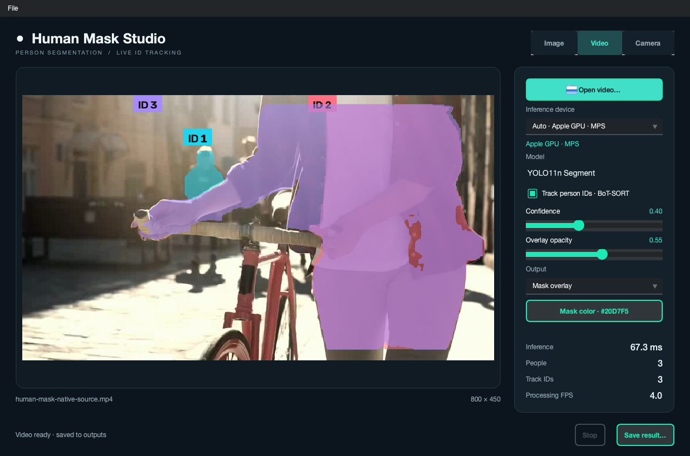
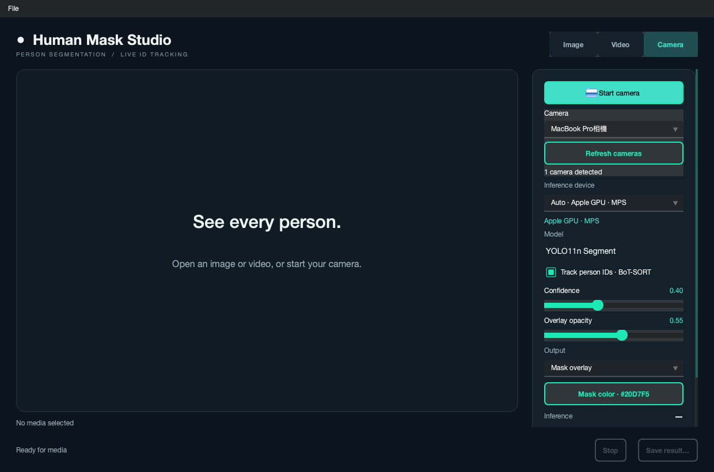
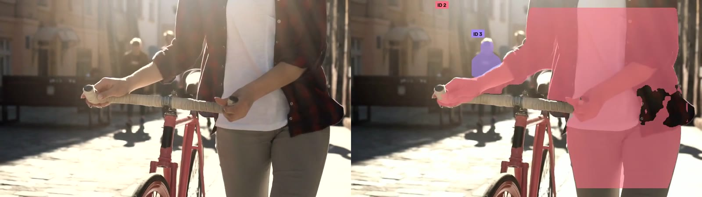
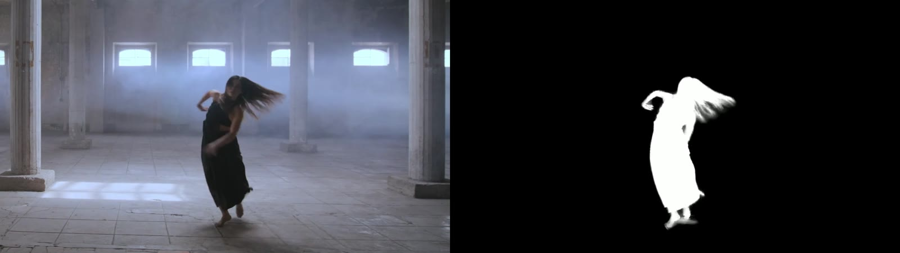

# Human Mask Studio

A native Python desktop application for person segmentation and multi-person ID tracking. Open an image or video, or use a camera for live YOLO11 masks with persistent BoT-SORT IDs.



## Features

- Native PySide6 windows, file dialogs, drag-and-drop, and a Qt Material dark theme.
- Image segmentation with adjustable confidence, opacity, mask color, and mask-only output.
- Video segmentation with live preview, progress, pause/resume, and MP4 export.
- Camera input with live masks, person IDs, and snapshot export.
- Automatic device selection: CUDA, Apple MPS, then CPU. The interface reports the selected device.
- Background inference and a single-frame camera mailbox to keep live previews current.

## Install

Create the environment inside the project directory:

```bash
conda create -p ./.conda python=3.12 pip -y
PYTHONNOUSERSITE=1 conda run -p ./.conda python -m pip install -r requirements.txt
```

Install FFmpeg for MP4 export. On macOS:

```bash
brew install ffmpeg
```

The first inference run downloads `yolo11n-seg.pt` into the project directory.

For NVIDIA RTX 50-series GPUs, install a CUDA-enabled PyTorch build with CUDA 12.8 or newer inside the project environment. For example:

```bash
PYTHONNOUSERSITE=1 conda run -p ./.conda python -m pip install --upgrade torch torchvision --index-url https://download.pytorch.org/whl/cu128
```

The application reads GPU names from PyTorch and lists each CUDA device separately. See the [PyTorch installation guide](https://pytorch.org/get-started/locally/) for platform-specific builds.

## Run

```bash
PYTHONNOUSERSITE=1 conda run --no-capture-output -p ./.conda python -m studio
```

On this macOS workstation, double-click `launch.command` to launch using the project's `.conda` environment.

Open a file or start a camera directly:

```bash
PYTHONNOUSERSITE=1 conda run --no-capture-output -p ./.conda python -m studio photo.jpg
PYTHONNOUSERSITE=1 conda run --no-capture-output -p ./.conda python -m studio --list-cameras
PYTHONNOUSERSITE=1 conda run --no-capture-output -p ./.conda python -m studio --camera
```

### Images and videos

Choose **Image** or **Video**, then open media using the button, **File → Open media**, or drag-and-drop. Use **Apply to image** after changing image settings. Video and camera settings update during inference. Videos retain every processed frame at their source frame rate; completed MP4 files are written to `outputs/`. **Save result** exports an image or copies a completed video to a chosen location.

### Camera



Choose **Camera**, select a device by name, and click **Start camera**. Click **Refresh cameras** after connecting or disconnecting a camera. Refresh preserves your selection by device ID, even when the device index changes. Enable **Track person IDs** for BoT-SORT tracking. **Stop** releases the camera; **Save result** saves the current segmented frame. The start button is disabled when no cameras are detected.

Use `python -m studio --camera "Camera name"` to start a specific device. `--list-cameras` prints names and device IDs; either can be passed to `--camera`.

On macOS, allow camera access when prompted. When running from Python, camera permission belongs to the launching application. Manage it in **System Settings → Privacy & Security → Camera**.

## Optional HTTP API

The desktop application runs inference directly. A FastAPI interface is also available for integrations:

```bash
PYTHONNOUSERSITE=1 conda run -p ./.conda python -m pip install -r backend/requirements.txt
PYTHONNOUSERSITE=1 conda run --no-capture-output -p ./.conda python -m uvicorn backend.app:app --host 127.0.0.1 --port 8001
```

- `POST /api/segment/image`: image segmentation.
- `POST /api/segment/video`: video segmentation and optional tracking.
- `GET /api/device`: active inference device and its display name.
- `GET /docs`: interactive API documentation.

## Tests

```bash
PYTHONNOUSERSITE=1 conda run --no-capture-output -p ./.conda python -m unittest discover -s tests -v
```

Tests cover device selection, mask composition, camera discovery and selection, refresh after index changes, startup buffering, disconnect cleanup, stop/restart, live settings, and window shutdown.

## Project structure

- `studio/engine.py`: shared YOLO inference, device selection, masks, and video encoding.
- `studio/workers.py`: background media processing and camera capture.
- `studio/cameras.py`: named device discovery and asynchronous refresh.
- `studio/window.py`: native desktop controls and preview.
- `studio/__main__.py`: application entry point and Qt Material theme.
- `backend/`: optional HTTP API and BoT-SORT configuration.

## Upstream projects

- [Qt for Python / PySide6](https://github.com/qtproject/pyside-pyside-setup): native Qt desktop widgets.
- [Qt Material](https://github.com/UN-GCPDS/qt-material): reusable Material-inspired Qt themes, including the `dark_teal` theme used by this application.
- [Ultralytics](https://github.com/ultralytics/ultralytics): YOLO11 person instance segmentation and tracker integration.
- [BoT-SORT](https://github.com/NirAharon/BoT-SORT): tracking and ReID, implemented through Ultralytics.
- [PyTorch](https://github.com/pytorch/pytorch): CPU, CUDA, and Apple MPS inference.
- [OpenCV](https://github.com/opencv/opencv): image/video decoding and camera capture.
- [cv2-enumerate-cameras](https://github.com/lukehugh/cv2_enumerate_cameras): camera names, device IDs, and capture backends.
- [FFmpeg](https://github.com/FFmpeg/FFmpeg): H.264 MP4 encoding.
- [FastAPI](https://github.com/fastapi/fastapi): optional HTTP integration.

## Segmentation examples

Original frame on the left; person masks and persistent tracking IDs on the right.



The separate [Robust Video Matting](https://github.com/PeterL1n/RobustVideoMatting) experiment produced the following alpha-mask comparison.


