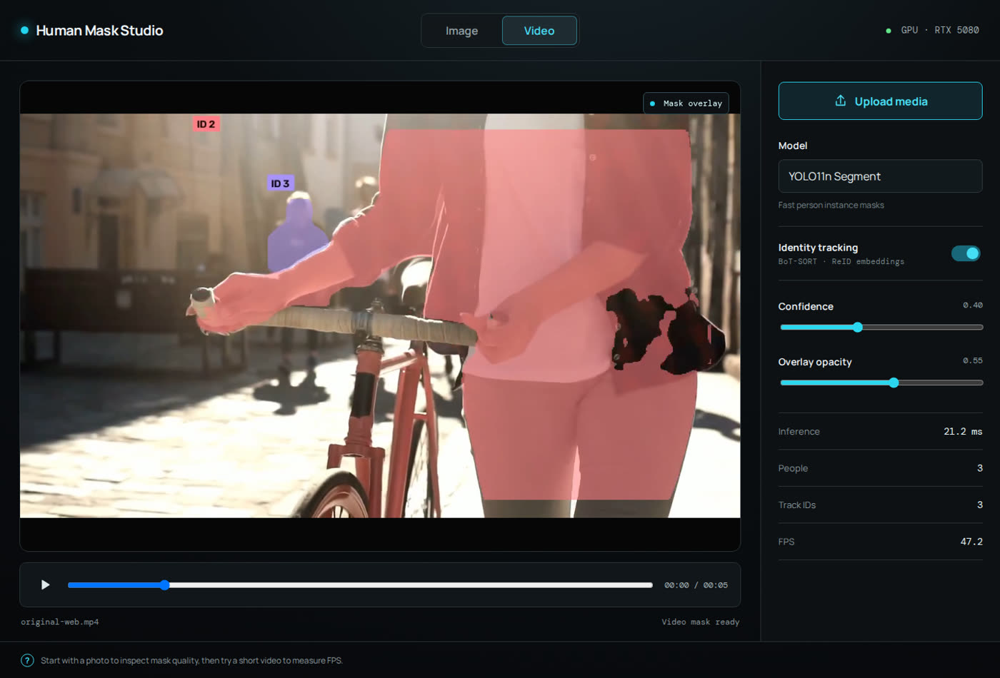

# Human Mask Studio

Local browser tool for visualizing YOLO person instance-segmentation masks on images and videos, with real-time multi-person ID tracking.

## Results

### Web interface

The current prototype reports per-video inference speed, peak concurrent people, and the number of track IDs. This example ran at about 47 FPS on an RTX 5080.



### Multi-person segmentation and ReID tracking

Original frame on the left; YOLO person masks with persistent BoT-SORT IDs and per-ID colors on the right.


### Matting experiment

Original dancing frame on the left; the pure alpha mask from the separate Robust Video Matting experiment on the right. RVM is an experiment artifact and is not part of the current FastAPI inference path.


## Run it

Terminal 1 (API; first run downloads `yolo11n-seg.pt`):

```bash
python -m pip install -r backend/requirements.txt
python -m uvicorn backend.app:app --reload --port 8001
```

The API uses `ffmpeg` to produce browser-compatible H.264 video, so it must be available on `PATH`.

Terminal 2 (UI):

```bash
npm install
npm run dev
```

Open the URL Vite prints (normally `http://localhost:5173`). Upload an image or video. The service only selects COCO class `person`, then blends each individual mask into the original media.

## Current scope

- Image: uploads and returns a YOLO-masked result immediately.
- Video: processes the selected video frame-by-frame then shows a masked MP4.
- Video tracking: BoT-SORT uses lightweight ReID embeddings to keep a stable ID and color for each person.
- Camera input is intentionally not included yet.

For long videos, this first prototype waits until processing finishes; streaming progress and webcam input are the next upgrades.

## Upstream projects and acknowledgements

This project uses or directly builds on the following open-source repositories:

- [Ultralytics](https://github.com/ultralytics/ultralytics) — YOLO11 instance segmentation and the tracking integration used by the API.
- [BoT-SORT](https://github.com/NirAharon/BoT-SORT) — multi-object tracking and ReID method; the runtime implementation is provided through Ultralytics.
- [PyTorch](https://github.com/pytorch/pytorch) — CUDA model inference runtime.
- [OpenCV](https://github.com/opencv/opencv) — video decoding, frame composition, masks, and ID labels.
- [FastAPI](https://github.com/fastapi/fastapi) — upload and inference HTTP API.
- [React](https://github.com/react/react) and [Vite](https://github.com/vitejs/vite) — browser interface and frontend tooling.
- [FFmpeg](https://github.com/FFmpeg/FFmpeg) — browser-compatible H.264 result encoding.
- [RobustVideoMatting](https://github.com/PeterL1n/RobustVideoMatting) — evaluated separately for the dancing-video alpha-mask result shown above; it is not used by the current API.

Please review and comply with each upstream project's license before redistribution or commercial deployment. In particular, Ultralytics offers AGPL-3.0 and enterprise licensing options, while the referenced Robust Video Matting repository is GPL-3.0.
